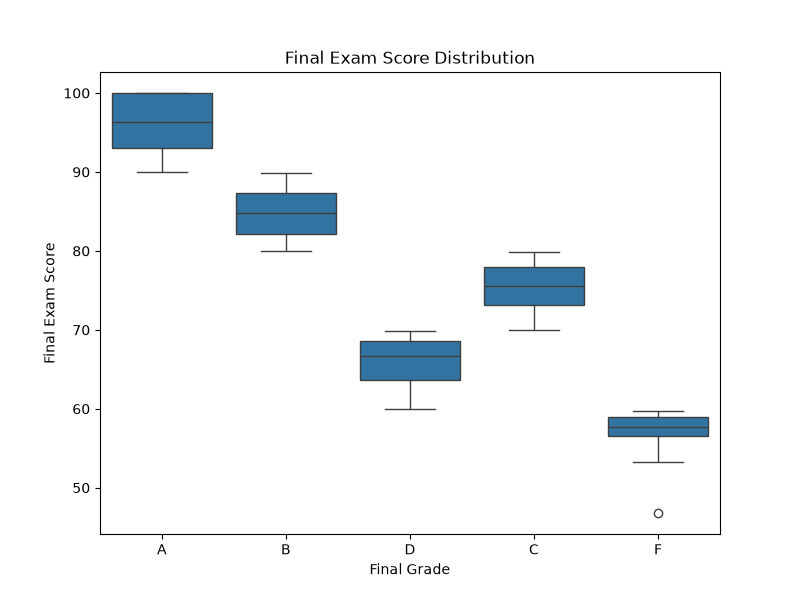
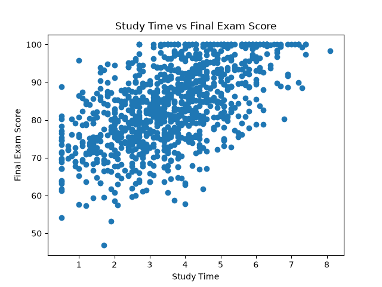
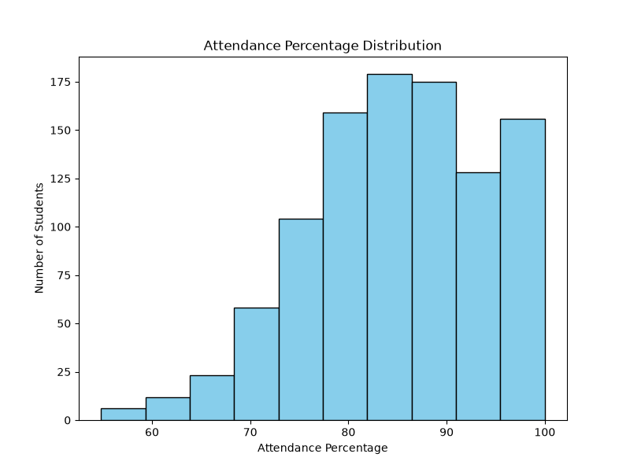
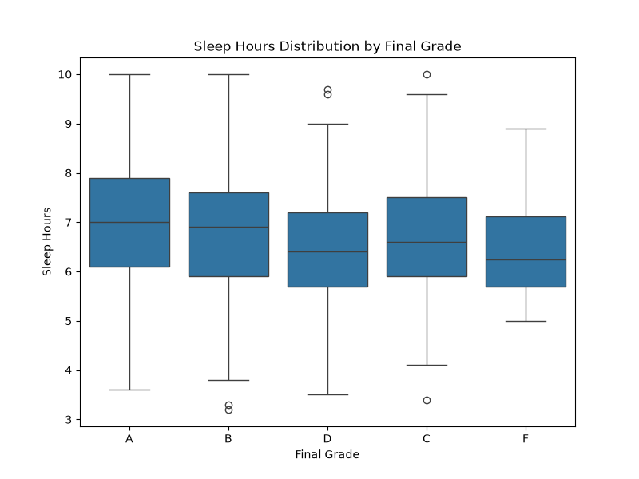

# Student Performance Analysis

Exploratory data analysis of 1,000 students to identify which factors — study time, attendance, sleep, and lifestyle habits — are most associated with final exam performance.

## Table of Contents
- [Overview](#overview)
- [Dataset](#dataset)
- [Tools & Libraries](#tools--libraries)
- [Project Workflow](#project-workflow)
- [Key Findings](#key-findings)
- [Visualizations](#visualizations)
- [Future Improvements](#future-improvements)

## Overview
This project explores a synthetic student performance dataset to answer a simple question: **what actually correlates with exam scores?** The analysis covers data cleaning, exploratory data analysis (EDA), and visualization, and is built as a portfolio piece to demonstrate a practical, end-to-end data analysis workflow using Python.

## Dataset
- **Source:** [Student Performance and Study Habits Dataset — Kaggle](https://www.kaggle.com/datasets/harshadapatil31/student-performance-and-study-habits-dataset)
- **File:** `student_performance_dataset.csv`
- **Rows:** 1,000 students
- **Columns:** 12

| Column | Description |
|---|---|
| `student_id` | Unique student identifier |
| `gender` | Male / Female |
| `study_time_hours` | Average daily study time (hours) |
| `attendance_percent` | Class attendance (%) |
| `sleep_hours` | Average daily sleep (hours) |
| `parental_education` | Highest parental education level |
| `internet_access` | Whether the student has internet access |
| `extracurricular_activities` | Participation in extracurriculars |
| `part_time_job` | Whether the student works part-time |
| `previous_grade` | Score from a prior assessment |
| `final_exam_score` | Final exam score (0–100) |
| `final_grade` | Letter grade (A–F) derived from the final score |

**Data quality notes:** `parental_education` had 102 missing values, which were forward-filled during cleaning. No duplicate rows were found.

## Tools & Libraries
- Python 3
- pandas — data cleaning and aggregation
- NumPy — numerical operations
- Matplotlib & Seaborn — data visualization
- Jupyter Notebook — analysis environment

## Project Workflow
1. **Import & Inspect** — loaded the dataset and reviewed its shape, data types, and summary statistics.
2. **Clean** — standardized column names, converted key fields to numeric types, checked for duplicates, and handled missing values in `parental_education`.
3. **Explore** — examined unique values across categorical columns and computed core statistics (mean, min, max) for numeric fields.
4. **Analyze** — grouped data by `final_grade` and other categories to compare outcomes, and built a correlation matrix against `final_exam_score`.
5. **Visualize** — produced distribution plots, a scatter plot, a box plot, and grouped bar charts to communicate the findings.

## Key Findings
- **Study time is the strongest driver of exam performance.** It has the highest correlation with final exam score (r ≈ 0.57) among all numeric features, and the scatter plot shows a clear upward trend.
- **Attendance matters, but less.** Attendance percentage shows a moderate positive correlation with final score (r ≈ 0.26).
- **Sleep has a weak but positive relationship** with final score (r ≈ 0.15); students in higher grade bands tend to average slightly more sleep.
- **Prior performance carries forward.** `previous_grade` correlates moderately with the final score (r ≈ 0.41), suggesting consistent performers tend to stay consistent.
- **Grade distribution:** most students land in the B (354) and A (284) bands, with fewer in C (261), D (89), and F (12) — a distribution skewed toward stronger performers.
- Average final exam score across all students is **83.5**, with scores ranging from 46.8 to 100.

## Visualizations

**Final Exam Score by Grade** — final scores form clean, well-separated bands across A–F, confirming the letter grade is a consistent summary of the numeric score.

**Study Time vs. Final Exam Score** — a clear upward trend: more study hours track with higher scores, consistent with it being the strongest correlated feature (r ≈ 0.57).

**Attendance Percentage Distribution** — most students cluster in the 75–100% attendance range, with a long tail toward lower attendance.

**Sleep Hours by Final Grade** — students with higher final grades tend to average slightly more sleep, though the effect is modest compared to study time.

## Future Improvements
- Build a simple regression model to predict `final_exam_score` from study time, attendance, and prior grade.
- Test statistical significance of group differences (e.g., part-time job vs. no job) rather than relying on averages alone.
- Package the cleaning steps into reusable functions or a small script.

